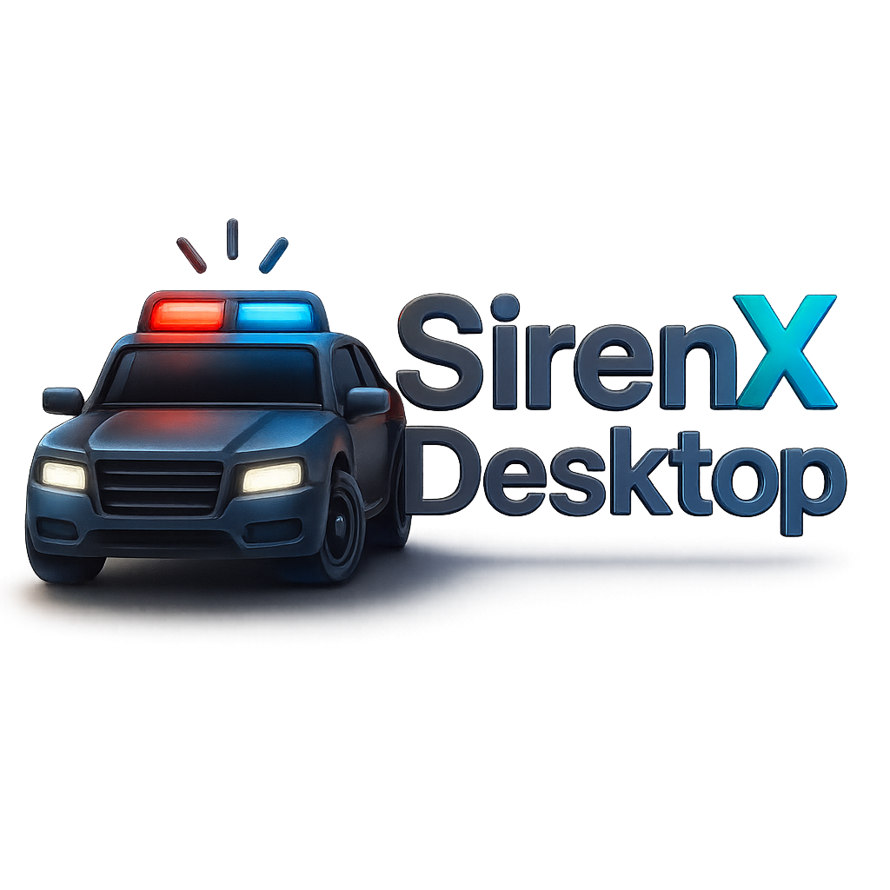

  

# SirenX Desktop - 3D Car Lighting Pattern Editor

A powerful desktop application for creating and editing vehicle lighting patterns for Grand Theft Auto V and FiveM servers, featuring real-time 3D preview capabilities.

## 🎯 What is SirenX Desktop?

SirenX Desktop is the evolution of the original SirenX web application, bringing enhanced functionality and 3D visualization to your desktop. Create stunning vehicle lighting patterns with an intuitive grid-based editor and see your designs come to life in real-time 3D preview.

## ✨ Key Features

- **🎮 3D Vehicle Visualization** - View your vehicle model in real-time as you edit lighting patterns
- **📁 Smart File Management** - Load entire vehicle folders instead of just individual files
- **⚡ Real-time Preview** - See lighting effects animate in real-time based on BPM settings
- **🔲 Intuitive Grid Editor** - Easy-to-use 32x20 grid interface for precise lighting control
- **🌈 Multiple Light Types** - Support for various light configurations with full color control
- **💾 Export Ready** - Save patterns directly to carcols.meta files for immediate use

## 🚀 Getting Started

### Quick Start
1. **Download** the latest release for your platform
2. **Install** the application
3. **Open** a vehicle folder and start creating!

### First Steps
1. Use **File → Open Vehicle Folder** to load your vehicle files
2. Use the **Lighting Editor** to place lights on the grid
3. Adjust **BPM settings** for timing control
4. Preview your creation in **3D view**
5. Save your pattern to use in-game

## 🎮 Use Cases

- **Emergency Services** - Create realistic police, fire, and ambulance lighting patterns
- **Custom Vehicles** - Design unique lighting for your custom car mods
- **Server Development** - Build professional lighting patterns for FiveM servers
- **Content Creation** - Record videos with custom vehicle lighting effects

## 📱 Screenshots

*Screenshots coming soon - showcasing the 3D editor, lighting grid, and file management interface*

## 🤝 Community & Support

- **Discord**: [Join our community](#)
- **GitHub Issues**: Report bugs and request features
- **Documentation**: Check [TECHNICAL.md](TECHNICAL.md) for detailed technical information

## 📄 License

This project is licensed under the MIT License - see the [LICENSE](LICENSE) file for details.

## 🙏 Acknowledgments

- **Nextarch Studio** - Development Team
- **Original SirenX** - Web Application Foundation

## 🔗 Links

- **Developer**: [Nextarch Studio](https://github.com/NextarchStudio)
- **Repository**: [SirenX-Desktop](https://github.com/NextarchStudio/SirenX-Desktop)
- **Website**: [Nextarch Studio](https://nextarch.studio)

- **Original SirenX**: [heyyczer/sirenx](https://github.com/heyyczer/sirenx)

---

**🎮 Transform your vehicle lighting from concept to reality with SirenX Desktop**

*Built with ❤️ by Nextarch Studio*
